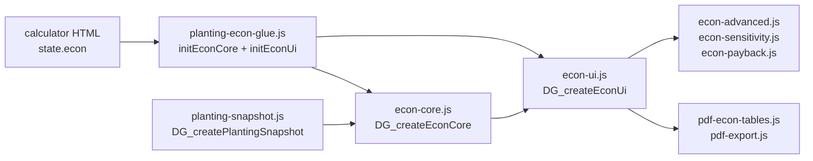

# Экономика фермы — карта восстановления

Связано с общей картой: [RECOVERY-MAP.md](./RECOVERY-MAP.md).

**Состояние:** `state.econ` (подмножество глобального `state` в `calculator-110x55_12.html`).  
**Хранение:** `localStorage` ключ `calc-econ-v3` (миграция с `calc-econ-v2` / `v1`).

---

## Оглавление

1. [Архитектура модулей](#1-архитектура-модулей)
2. [Поток данных](#2-поток-данных)
3. [Структура state.econ](#3-структура-stateecon)
4. [Связь с посадкой (снимки)](#4-связь-с-посадкой-снимки)
5. [Импорт из посадки](#5-импорт-из-посадки)
6. [Формулы calcFarmEconomics](#6-формулы-calcfarmeconomics)
7. [Строка культуры (culture row)](#7-строка-культуры-culture-row)
8. [Специальные id](#8-специальные-id)
9. [UI и события](#9-ui-и-события)
10. [Расширения (advanced)](#10-расширения-advanced)
11. [Диагностика](#11-диагностика)
12. [Чеклист после правок](#12-чеклист-после-правок)

---

## 1. Архитектура модулей



| Модуль | Фабрика | Роль |
|--------|---------|------|
| `js/econ-core.js` | `DG_createEconCore` | **Все формулы**: культуры, свет, ФОТ, налоги, `calcFarmEconomics`, импорт |
| `js/planting-econ-glue.js` | `DG_createPlantingEconGlue` | Связывает econ с `state`, snapshot, каталогами; `loadEconStore` / `saveEconStore` |
| `js/planting-snapshot.js` | `DG_createPlantingSnapshot` | Снимок посадки по `cvId` для урожая/света/площади |
| `js/econ-ui.js` | `DG_createEconUi` | Таблицы, кнопки, `renderEconomics`, `syncEconFromPlanting` |
| `js/econ-presets.js` | — | Пресеты CAPEX/OPEX |
| `js/econ-csv-export.js` | — | CSV |
| `js/econ-sensitivity.js` | — | «Что если» — только повторный `calcFarmEconomics` |
| `js/econ-payback.js` | — | Окупаемость по cash-flow |
| `js/econ-advanced.js` | — | Сезонность, площадки, каналы сбыта |
| `js/pdf-econ-tables.js` | — | Таблицы для PDF |
| `js/project-summary.js` | — | Краткое резюме проекта с econ |

**Константы** (дублируются в `global.DG_ECON` и glue):

- `ECON_MAX_CULTURES = 6`
- `ECON_MONTH_DAYS = 30.5` (из `DG_CUT.HARVEST_MONTH_DAYS`)
- `ECON_SALAD_MIX_ID = '__salad_mix__'`
- `ECON_SALAD_MIX_CV_IDS` — список vf-id для усреднённого микса

---

## 2. Поток данных

### 2.1. Открытие вкладки «Экономика»

1. `setAppView('economics')` — `planting-app-nav.js`
2. `renderEconomics()` — `econ-ui.js`
3. Внутри: `calcFarmEconomics(state.econ)` → отрисовка таблиц, предупреждений, окупаемости

### 2.2. Изменение поля в экономике

1. `input` / `change` на `#view-economics` → обновление `state.econ.*`
2. `saveEconStore()` → localStorage
3. `renderEconomics()` → пересчёт

### 2.3. Импорт из посадки

Кнопки: `#econ-sync-planting`, `#btn-import-econ-quick` → `runPlantingEconImport()` → `syncEconFromPlanting()` → **`importAllEconFromPlanting()`**.

---

## 3. Структура state.econ

Инициализация: `getDefaultEconState()` в `econ-core.js` (через glue при первом заходе).

### 3.1. Площади и цены

| Поле | Смысл | Влияет на |
|------|--------|-----------|
| `plantingArea` | Посевная площадь, м² | Доля площади каждой культуры |
| `floorArea` | Площадь пола (≥ planting) | Отображение, не всегда в формулах |
| `priceKwh` | ₽/кВт·ч | Свет по культурам + прочее электричество |
| `salePrice` | Цена по умолчанию, ₽/кг или ₽/шт | Если в строке культуры `salePrice` = 0 |

Импорт подставляет `priceKwh` из `state.pricePerKwh` (посадка).

### 3.2. Культуры — массив `cultures[]`

До **6** строк. Каждая строка (`normalizeEconCultureRow`):

| Поле | Смысл |
|------|--------|
| `cvId` | id сорта (`aficion`, `vf-sorrel`, `pl-shiso`, `__salad_mix__`) |
| `pct` | % посевной площади (сумма может быть ≠ 100 — см. scale) |
| `salePrice` | Цена продажи этой культуры |
| `density` | шт/м² (стояние) |
| `yieldPerCut` | Урожай за срез, г или шт |
| `cutIntervalDays` | Интервал срезки, сут |
| `kwhPerM2Hour` | кВт·ч/(м²·ч) освещения |
| `lightHoursDay` | Часов света в сутки |
| `consumablesPerPot` | Расходники на горшок за цикл жизни, ₽ |
| `potHarvestMonths` | Срок жизни горшка, мес (амортизация расходников) |
| `unitIsPieces` | true → выход и выручка в **шт**, не кг |

### 3.3. OPEX и налоги

| Поле | Смысл |
|------|--------|
| `rentMonth` | Аренда |
| `staffLines[]` | `{ id, label, salary }` |
| `payrollTax` | Начислять ~30% на ФОТ |
| `accountingMonth` | Бухгалтерия |
| `logisticsMonth` | Логистика |
| `otherMonth` | Прочие |
| `elecCats` | `{ pumps, fans, heating, equipment, refrigeration, packaging, misc }` → `{ kw, h }` |
| `wastePct` | Потери после сбора, % |
| `consumablesPerKg` | Устаревший глобальный ₽/кг (если нет per-pot) |
| `usnTax`, `vatTax`, `profitTax` | Флаги налогов |
| `vatPct`, `profitTaxPct` | Ставки |
| `amortMonths` | Срок амортизации CAPEX |

### 3.4. Оборудование (CAPEX)

| Поле | Смысл |
|------|--------|
| `equipmentEnabled` | Учитывать CAPEX в амортизации |
| `equipment` | Словарь статей (`prodMain`, `solutionUnit`, …) |
| `equipmentCustom[]` | Произвольные строки `{ label, amount }` |

Группы — `ECON_EQUIPMENT_GROUPS_RAW` в `econ-core.js` (ключи i18n `econ.eq.*`).

---

## 4. Связь с посадкой (снимки)

Экономика **не вызывает** полный UI `calc()` при каждом поле — она берёт **снимок** параметров урожая и света.

### 4.1. Ключевые функции

| Функция | Файл | Назначение |
|---------|------|------------|
| `getPlantingSnapshot()` | snapshot | Текущий экран: `calc()` + `buildPlantingSnapshot` |
| `getPlantingSnapshotForCvId(cvId)` | snapshot | Снимок для **любого** id без смены UI |
| `getPlantingStateEconSlice()` | snapshot | Копия полей state для временной подмены |
| `restorePlantingStateEconSlice(sl)` | snapshot | Откат после расчёта «чужого» сорта |
| `plantingCvIdMatchesLiveState(cvId)` | snapshot | Совпадает ли id с активным на экране посадки |

### 4.2. getPlantingSnapshotForCvId — ветки

```text
cvId пустой → getPlantingSnapshot()
cvId === __salad_mix__ → усреднение ECON_SALAD_MIX_CV_IDS

cvId совпадает с live (palletCv / vfCv / cv):
  → calcFromPalletSheet | calcFromVfSheet | calc()
  → buildPlantingSnapshot, profileSource: 'live'

иначе (справочный расчёт):
  сохранить slice state
  pl-* → appView=pallets, applyPalletStandardsFromSheet({ econ: true }), calcFromPalletSheet
  vf-* → applyVfProfileToStateOnly(default), calcFromVfSheet
  gh   → facility=greenhouse, applyGhProfileToStateOnly, calc()
  восстановить slice
  profileSource: 'default' | 'saved'
```

**Важно:** временно меняется `state.appView`, `palletCv`, `multicut` и т.д. — только внутри `try/finally` с restore.

### 4.3. Поля снимка (для econ)

Из `buildPlantingSnapshot` + `plantingHarvestYieldParams`:

| Поле снимка | Использование в econ |
|-------------|----------------------|
| `yieldPerPotCycle` / `harvestYieldPerCut` | `yieldPerCut` в строке культуры |
| `harvestCutIntervalDays` | `cutIntervalDays` |
| `harvestCutsPerMonth` | проверки multicut |
| `multicutHarvest` | режим срезок vs полный цикл |
| `unitIsPieces` | шт vs кг |
| `rhoA` | → `density` через `snapDensity` |
| `kwhPerM2Hour`, `lightHoursDay` | свет в строке |
| `sysArea` | `plantingArea` при импорте |
| `potHarvestMonths` | из `parsePotHarvestMonthsFromCv` |

`plantingHarvestYieldParams` дублирует логику `planting-useful-yield.js` (многосрезка, цветы на поддонах в шт).

---

## 5. Импорт из посадки

**Файл:** `econ-core.js` → `importAllEconFromPlanting()`.

Шаги:

1. `state.econ.priceKwh = state.pricePerKwh`
2. `ensureEconCultures()`
3. Площадь: `ghUsefulArea` → иначе `liveSnap.sysArea` → `plantingArea` / `floorArea`
4. Активный сорт `getActivePlantingCvId()`:
   - найти/создать строку в `cultures`
   - `importEconRowFromPlanting(row)`
5. Для **каждой** заполненной строки — снова `importEconRowFromPlanting`
6. `dedupeEconCultures()`, если одна культура — `pct = 100`
7. `saveEconStore()`

### 5.1. importEconRowFromPlanting(row)

1. `getPlantingSnapshotForCvId(cvId)`
2. `econYieldParamsForCvId(cvId, snap)` → `yieldPerCut`, `cutIntervalDays`
3. `snapDensity`, свет, `unitIsPieces`, `potHarvestMonths`
4. `consumablesPerPot` по умолчанию 4 ₽ если пусто

### 5.2. econYieldParamsForCvId — приоритет

1. Если в snap `multicutHarvest` → урожай/интервал из snap
2. Если `main_hall` / `mainHallIntervalDays` → из snap (однократный цикл в канале)
3. Если GH multicut → из `ghStandards` + `econGhYieldPerCutFromStd`
4. Иначе `econSheetYieldPerCut` + `econSheetCutIntervalDays` из snap/листа

### 5.3. Активный id посадки

`getActivePlantingCvId()` — `planting-pallet-runtime.js`:

```text
pallets + каталог → state.palletCv
VF на каналах      → state.vfCv
иначе              → state.cv
```

---

## 6. Формулы calcFarmEconomics

**Вход:** объект `e` (= `state.econ`).  
**Выход:** большой объект `farm` (выручка, OPEX, маржа, разбивки кг/шт, предупреждения).

### 6.1. Масштаб площади

```text
plantingArea = e.plantingArea
totalPct = sum(cultures[].pct)
scale = totalPct > 100 ? 100 / totalPct : 1
area_i = plantingArea * pct_i / 100 * scale
```

Если сумма долей > 100%, доли **сжимаются** пропорционально (предупреждение `econ.warn.pctOver`).

### 6.2. Срез одной культуры — calcCultureSliceFromRow

Из `econCultureBio(row)`:

```text
cutsPerMonth = ECON_MONTH_DAYS / cutIntervalDays
yieldPerPotMonth = yieldPerCut * cutsPerMonth

если unitIsPieces:
  yieldPerSqmMonthPcs = yieldPerPotMonth * density
  monthlyOutput = yieldPerSqmMonthPcs * area
  revenue = monthlyOutput * salePrice   // ₽/шт
иначе:
  yieldPerSqmMonthKg = (yieldPerPotMonth / 1000) * density
  monthlyOutput = yieldPerSqmMonthKg * area
  revenue = monthlyOutput * salePrice   // ₽/кг

lightKwhMonth = area * kwhPerM2Hour * lightHoursDay * ECON_MONTH_DAYS
lightCost = lightKwhMonth * priceKwh
consumablesCost = f(consumablesPerPot, pots, potHarvestMonths, …)
```

### 6.3. Фиксированные OPEX

```text
payroll = staffLines + налог 30% + accounting + custom
equipAmort = sum(equipment) / amortMonths   // если equipmentEnabled
fixedOpex = rent + payroll + logistics + other + otherElec + equipAmort
```

`otherElec` — из `elecCats` (кВт × ч × 30.5 × priceKwh по категориям).

### 6.4. Итог

```text
revenue = (revKg + revPcs) * (1 - wastePct/100)
monthlyOpex = fixedOpex + sum(lightCost) + sum(consumablesCost)
налоги: УСН 6%, НДС, налог на прибыль — по флагам
margin = profitBeforeTax - profitTax
```

Разделение себестоимости на кг и шт — пропорционально `areaKg` / `areaPcs`.

---

## 7. Строка культуры (culture row)

### 7.1. Выбор сорта в UI

`econApplyCultureSelect(row, cvId, pct, salePrice)`:

- Если `plantingCvIdMatchesLiveState(cvId)` → **импорт из live** snapshot
- Иначе → `econCatalogDefaultsForCvId(cvId)` из листа/снимка по умолчанию

### 7.2. Каталог по умолчанию — econCatalogDefaultsForCvId

| Тип id | Источник |
|--------|----------|
| `pl-*` | `allPalletCultivars` + `getPlantingSnapshotForCvId` |
| `vf-*` | `allVfCultivars` + snapshot |
| GH | `getGhCvStandards` / snapshot |
| `__salad_mix__` | среднее по `ECON_SALAD_MIX_CV_IDS` |

---

## 8. Специальные id

### 8.1. Микс салатов `__salad_mix__`

- В опциях культур отдельный пункт
- Урожай/плотность — среднее по фиксированному списку VF baby
- Нельзя дублировать id из списка микса в других строках (`econ.warn.mixOverlap`)

### 8.2. Штучные культуры (цветы на поддонах)

- `unitIsPieces: true` в snapshot
- В econ: выручка и выпуск в **шт**, себестоимость делится `fixedPcs` / `lightPcs`

---

## 9. UI и события

| Элемент | Файл | Действие |
|---------|------|----------|
| `#view-economics` | econ-ui | контейнер вкладки |
| `renderEconomics()` | econ-ui | полная перерисовка |
| `syncEconInputsFromState()` | econ-ui | поля ← state |
| `syncEconFromPlanting()` | econ-ui | → `importAllEconFromPlanting` |
| Кнопка PDF | pdf-export + econ tables | `calcFarmEconomics` для данных |

**Glue init** (`planting-econ-glue.js` → `initEconCore`):

- Вызывается из inline после загрузки модулей
- Пробрасывает в `DG_createEconCore`: snapshot, каталоги, `findCvById`, `supportsMulticut`, …

**Проекты:** `project-store.js` сохраняет весь `state` включая `econ` → `applyProjectState` → `setAppView`.

---

## 10. Расширения (advanced)

Все **только** вызывают `calcFarmEconomics` с модифицированной копией `econ`, формулы ядра не дублируют.

| Модуль | Что делает |
|--------|------------|
| `econ-sensitivity.js` | Таблица сценариев (цена, kWh, урожай ±%) |
| `econ-payback.js` | Cash-flow, срок окупаемости CAPEX |
| `econ-advanced.js` | Сезонность урожая, несколько площадок, каналы сбыта, инфляция |

Инициализация — из `planting-econ-glue.js` после `initEconUi`.

---

## 11. Диагностика

| Симптом | Проверить |
|---------|-----------|
| Импорт пустой / нули | `getPlantingSnapshotForCvId` — загружен ли `pallet-cultivars.js`; консоль при `applyPalletStandardsFromSheet` |
| Неверный урожай для поддона | snapshot: `multicutHarvest`, `unitIsPieces`; посадка: `planting-useful-yield` |
| Плотность 0 | `snap.rhoA`, `row.density` после `snapDensity` |
| Сумма долей > 100% | `econCulturesTotalPct`, предупреждение в UI |
| Дубли сортов | `dedupeEconCultures`, `findDuplicateCultureIds` |
| Старые данные econ | localStorage `calc-econ-v3`; очистить в DevTools |
| `calcFarmEconomics is not a function` | не вызван `initEconCore` в glue; порядок скриптов |
| PDF econ пустой | `renderEconomics` перед экспортом; `DG_exportEconCsv` |

**Консоль:** при импорте смотреть `getPlantingSnapshotForCvId('pl-…')` вручную через `DG_installPlantingPublicApi` если exposed.

---

## 12. Чеклист после правок

- [ ] `npm run check`
- [ ] Посадка: поддон + канал + VF — импорт в экономику, поля заполнились
- [ ] Цветок `pl-*` с `countUnit: 'шт'` — в econ шт/м²·мес, выручка в шт
- [ ] 2–3 культуры, сумма pct 100% и 120% — предупреждения
- [ ] Сохранение проекта / перезагрузка — `econ` на месте
- [ ] PDF экономики — таблицы с цифрами
- [ ] EN locale — ключи `econ.*` в `i18n-econ-extras.js`

---

*При изменении `econ-core.js` или `planting-snapshot.js` обновляйте этот файл и §19 в [RECOVERY-MAP.md](./RECOVERY-MAP.md).*
