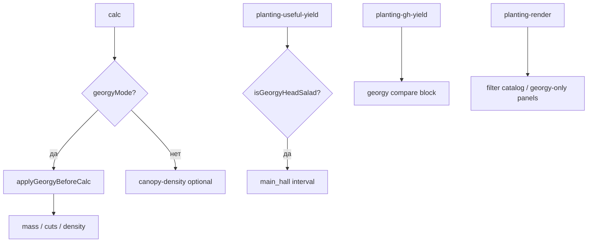

# Режим «Расчёт для Георгия»

Упрощённый сценарий **теплицы (каналы, GH)** для профиля заказчика: салаты головные + беби в стаканах (руккола / салат), многосрезка, 2 ряда в канале.

**Не** работает на вкладке Поддоны (при включении сбрасывает `appView` на `channels`).

---

## 1. Модуль и включение

| | |
|--|--|
| Файл | `js/georgy-mode.js` |
| Фабрика | `DG_createGeorgyMode(deps)` из `planting-late-init.js` |
| Кнопка | `#btn-georgy-mode` |
| Storage | `localStorage` `calc-georgy-mode` = `'1'` |
| Плотность (отдельно) | `calc-georgy-target-density` |

```javascript
state.georgyMode  // boolean
state.georgyRestore // снимок state до включения (для отката)
state.georgyDensityFitted
state.georgyTargetDensity
state.georgyChannel2Rows
state.georgyManualCutMasses  // не затирать ghCutMasses при пересчёте
```

HTML: класс `georgy-active` на `<html>`, блоки `.georgy-only` / `.georgy-hide`.

---

## 2. Профили беби

Встроенные профили (не из каталога Excel):

| id | Константа | Суть |
|----|-----------|------|
| `rucola-baby` | `RUCOLA_PROFILE` | 8–18 сут интервал, до 8 срезок при жаре |
| `lettuce-baby` | `LETTUCE_PROFILE` | до 12 срезок ниже 30°C |

Оба: `channelRows: 2`, плотность 80–110, массы срезок в `cutMasses[]`, жара `BABY_HEAT`.

`getGeorgyProfile(cv)` — есть ли профиль для текущего сорта.

### Салаты «головные»

`isGeorgyHeadSalad(cv)` — не беби-профиль: один срез, подбор плотности по шапке (`canopy-density-ui`).

---

## 3. Что меняется в calc()

**Точка входа:** `applyGeorgyBeforeCalc()` в начале `planting-calc-core.js` → `calc()`.

| Область | Поведение в режиме Георгия |
|---------|---------------------------|
| Список сортов | `filterGeorgyCultivars` — скрывает «лишние» id (`GEORGY_HIDDEN_CV`) |
| Плотность | авто из шапки или `georgyTargetDensity` |
| Беби | `normativeBabyCutMass`, фикс. `ghCutMasses`, интервал срезки |
| Салат головной | `totalDaysFromSowGeorgy`; оборот = `headMainChannelDays()`; подбор плотности по **середине** кроны `headCanopyFitRange().mid` (напр. ~13,5 см при 12–15) |
| Урожай с площади | `mainHarvestIntervalDays`, `headHarvestCyclesPerMonth` в `planting-useful-yield` |
| Жара | `georgyYieldFactor(profile, temp)` вместо обычного `tempFactor` |

`isGeorgyGh()` = `state.georgyMode && facility === 'greenhouse' && !pallets && !VF`.

---

## 4. UI

| Элемент | id / класс |
|---------|------------|
| Панель | `#panel-georgy-simple` |
| Гайд | `#panel-georgy-guide` |
| Кнопки стандартов | `#georgy-rucola-std`, `#georgy-lettuce-std` |
| Подсказка плотности | `#georgy-profile-rec` |
| Сравнение урожая GH | `.gh-yield-georgy-compare` |
| Скрыто в PDF preview | auth-preview CSS |

`syncGeorgyControls(r)` — после `renderAll`, обновляет предупреждения и подписи.

`usesGeorgyChannel2Rows(cv)` — геометрия 2 ряда в канале (`plantLayout` vfMode).

---

## 5. Взаимодействие с другими модулями



| Модуль | Связь |
|--------|--------|
| `canopy-density-ui.js` | Подбор ρ по шапке для головных салатов |
| `planting-gh-standards.js` | Срезки GH; `georgyManualCutMasses` |
| `planting-render.js` | Каталог только georgy-сорта в режиме |
| `georgy-mode.js` | При toggle: `state.appView = channels` если был pallets |

---

## 6. toggleGeorgyMode

1. Сохраняет `georgyRestore` (снимок ключевых полей) при включении  
2. Включает/выключает `state.georgyMode`, класс `georgy-active`  
3. При включении: `facility = greenhouse`, сорт → руккола/салат беби при необходимости  
4. `renderAll()`, `localStorage`  
5. При выключении — восстановление из `georgyRestore`

---

## 7. Предпросмотр / share

- `preview-config.js`: **`georgyMode` всегда false** для гостей  
- В `auth-preview` кнопка и панели Георгия скрыты CSS  
- Демо JSON: перед сборкой preview выключить Георгия (см. [SHARE-AUTH-READONLY-RECOVERY.md](./SHARE-AUTH-READONLY-RECOVERY.md))

---

## 8. Диагностика

| Симптом | Причина |
|---------|---------|
| Кнопка не видна | не GH / georgy-hide CSS |
| На поддонах странно | режим только GH; включение уводит на channels |
| Плотность «залипла» | `georgyDensityFitted`, сброс через UI плотности |
| Срезки сбрасываются | `georgyManualCutMasses` false → перезапись нормативом |
| Урожай месяц другой | ветка `isGeorgyHeadSalad` в useful-yield |

---

## 9. Чеклист правок

1. Менять профили в `RUCOLA_PROFILE` / `LETTUCE_PROFILE`  
2. Проверить `applyGeorgyBeforeCalc` и `filterGeorgyCultivars`  
3. Каналы + включённый режим: руккола беби, салат беби, головной салат  
4. PDF: секция `panel-georgy-simple` только если режим on (`pdf-export.js` `georgyOnly`)  
5. `npm run check`

---

*Карта посадки: [RECOVERY-MAP.md](./RECOVERY-MAP.md) §18.*
