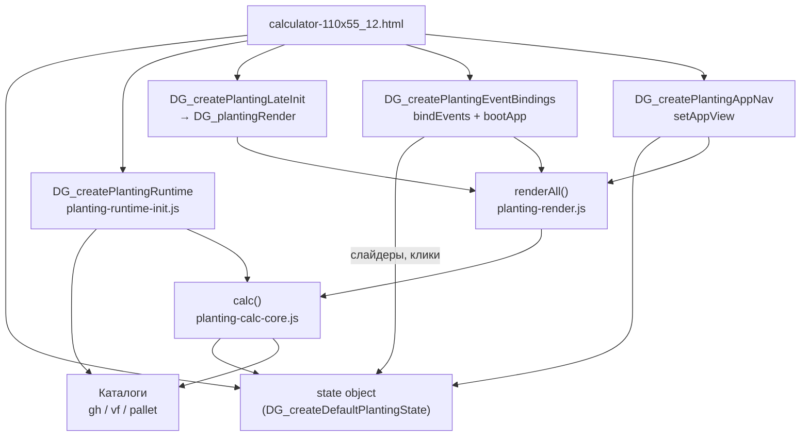

# Карта восстановления калькулятора Daogreen

**Назначение:** внутренняя «память проекта» — что откуда грузится, как считается, что на что влияет, что ломается при типичных правках.  
**Актуальная сборка:** `CALC_BUILD = 2026-05-20-p109-pdf-sections` (в `calculator-110x55_12.html` и `sw.js`).  
**Главный файл приложения:** `calculator-110x55_12.html` (~3800 строк: разметка + огромный inline-glue).

Связанные документы:

- [HOSTING.md](../HOSTING.md) — деплой, PWA, сервер, вход
- **Посадка и данные**
  - [PALLET-CULTIVARS-GENERATION.md](./PALLET-CULTIVARS-GENERATION.md) — Excel → `pallet-cultivars.js`
  - [VF-CULTIVARS-GENERATION.md](./VF-CULTIVARS-GENERATION.md) — Excel → `vf-cultivars.js`
  - [GH-CULTIVARS-RECOVERY.md](./GH-CULTIVARS-RECOVERY.md) — GH каталог, стандарты, UI
  - [GEORGY-MODE-RECOVERY.md](./GEORGY-MODE-RECOVERY.md) — режим «Расчёт для Георгия»
- **Экономика, доступ, отчёты**
  - [ECONOMICS-RECOVERY.md](./ECONOMICS-RECOVERY.md) — `state.econ`, импорт, формулы
  - [SHARE-AUTH-READONLY-RECOVERY.md](./SHARE-AUTH-READONLY-RECOVERY.md) — share, auth, readonly, preview
  - [PDF-PROJECTS-RECOVERY.md](./PDF-PROJECTS-RECOVERY.md) — JSON-проекты, PDF
- **Проверки**
  - [TESTING-RECOVERY.md](./TESTING-RECOVERY.md) — `npm run check`, smoke, golden
- Справочники: [CULTIVAR_CATALOG.md](./CULTIVAR_CATALOG.md), [LETTUCE_CULTIVARS_REFERENCE.md](./LETTUCE_CULTIVARS_REFERENCE.md)

---

## Оглавление

1. [Как пользоваться этим файлом](#1-как-пользоваться-этим-файлом)
2. [Быстрая диагностика «сломалось»](#2-быстрая-диагностика-сломалось)
3. [Архитектура в одной картинке](#3-архитектура-в-одной-картинке)
4. [Режимы приложения (главный рычаг)](#4-режимы-приложения-главный-рычаг)
5. [Единый объект state](#5-единый-объект-state)
6. [Порядок загрузки скриптов](#6-порядок-загрузки-скриптов)
7. [Цепочка инициализации (boot)](#7-цепочка-инициализации-boot)
8. [Сорта и каталоги](#8-сорта-и-каталоги)
9. [Ядро расчёта calc()](#9-ядро-расчёта-calc)
10. [Формулы и модели](#10-формулы-и-модели)
11. [Геометрия и плотность](#11-геометрия-и-плотность)
12. [Поддоны (pallet sheet)](#12-поддоны-pallet-sheet)
13. [VF (вертикальная ферма)](#13-vf-вертикальная-ферма)
14. [Урожай с полезной площади](#14-урожай-с-полезной-площади)
15. [UI: renderAll и культуры](#15-ui-renderall-и-культуры)
16. [События DOM](#16-события-dom)
17. [Снимки вкладок channels ↔ pallets](#17-снимки-вкладок-channels--pallets)
18. [Режим Георгия](#18-режим-георгия)
19. [Экономика](#19-экономика)
20. [i18n и форматирование](#20-i18n-и-форматирование)
21. [PWA, кэш, версии](#21-pwa-кэш-версии)
22. [Сборка и проверки](#22-сборка-и-проверки)
23. [Справочник модулей js/](#23-справочник-модулей-js)
24. [Каталог _tools/](#24-каталог-_tools)
25. [Матрица «изменил X → проверь Y»](#25-матрица-изменил-x--проверь-y)
26. [Хрупкие места (2026-05)](#26-хрупкие-места-2026-05)

---

## 1. Как пользоваться этим файлом

| Задача | Куда смотреть |
|--------|----------------|
| «Не кликаются культуры на поддонах» | §15, §16, §26 |
| «Нет списка поддонов / предупреждение pallet-cultivars» | §6, §8, §12 |
| «Старый UI после деплоя» | §21, §22 |
| «Неправильный урожай шт vs кг» | §10, §14, §12 |
| «Импорт в экономику пустой» | §19, §9 |
| «Рефакторинг inline в HTML» | §7, §23, `_tools/split-calculator-*` |
| Добавить сорт | §8 + `pallet-cultivars.js` / `js/gh-cultivars*.js` |

**Правило:** почти вся логика живёт в **одном** `state` (см. §5). Любой модуль получает его через `getState()` в `deps`. Если два места пишут в разные поля или читают не тот id сорта — баг.

---

## 2. Быстрая диагностика «сломалось»

| Симптом | Вероятная причина | Файлы / действие |
|---------|-------------------|------------------|
| Пустая плашка «Сборка», белый экран | Синтаксис JS, не загрузился модуль | Консоль F12; `node --check js/...` |
| `cultivar-registry.js не загружен` | Порядок `<script>` | §6 |
| Поддоны: нет культур, жёлтый badge | `PALLET_CULTIVARS.length === 0` | Открыть через **сервер**, не `file://`; `pallet-cultivars.js` |
| Поддоны: клик не меняет сорт | Перерисовка `#cultivars` во время клика; нет `data-pl-id` | §15–16; `planting-event-bindings.js`, `cvPanelRefreshNeeded` |
| Урожай цветов в кг вместо шт | `countUnit !== 'шт'` или обход `DG_countIsPieces` | `planting-constants.js`, `planting-useful-yield.js`, `cut-model.js` |
| Каналы показывают поддонный текст | `isPalletView()` / i18n ключи | `planting-gh-yield.js`, `i18n-plant-dynamic.js` |
| PDF квадратики | Шрифты / не через сервер | `HOSTING.md` |
| После git pull старое поведение | SW-кэш | Ctrl+F5; `npm run build`; §21 |
| `renderAll is not a function` | `DG_plantingRender` не установлен | `planting-late-init.js` до `bindEvents` |
| Георгий включился сам | `state.georgyMode` / localStorage | `georgy-mode.js` |

**Минимальный smoke после правок:**

```bash
npm run check
```

Открыть: Каналы → Поддоны → смена культуры → слайдер плотности → Экономика → PDF.

---

## 3. Архитектура в одной картинке



**Поток данных при действии пользователя:**

1. Событие (клик, `input` слайдера) → меняет `state.*`
2. `renderAll()` → `calc()` → объект `r` (результат)
3. `renderAll()` обновляет DOM: метрики, график, схема, урожай, стандарты
4. Условно `renderCultivars()` — сетка сортов (см. §15)

---

## 4. Режимы приложения (главный рычаг)

Два **независимых** измерения:

### 4.1. Вкладка: `state.appView`

| Значение | UI | Расчёт посадки |
|----------|-----|----------------|
| `channels` | Каналы (NFT теплица) | `calc()` → GH + `getCv()` |
| `pallets` | Поддоны 130×65 | `calc()` → `calcFromPalletSheet(getPalletCv())` |
| `economics` | Экономика фермы | `calcFarmEconomics`, не `calc()` |
| `standards` | Справочник нормативов | `standards-catalog-table.js` |

`setAppView()` — **`js/planting-app-nav.js`**.  
При переключении `channels` ↔ `pallets` сохраняется/восстанавливается снимок (§17).

### 4.2. Среда: `state.facility`

| Значение | Влияние |
|----------|---------|
| `greenhouse` | Сезонный DLI по `state.month`, блоки `.scen-gh-only` |
| `vertical` | VF-лист, `getVfCv()`, RH, PPFD; на вкладке **Каналы** при VF — расчёт из VF-листа |

**Важно:** на вкладке **Поддоны** `isPalletView()` = `(appView === 'pallets')` — **не смотрит** на `facility`. Поддоны могут при `facility === 'vertical'` всё равно идти в pallet sheet.

### 4.3. Какой сорт «активен»

| Режим | Поле state | Резолвер |
|-------|------------|----------|
| Каналы GH | `state.cv` | `getCv()` |
| VF (на каналах) | `state.vfCv` | `getVfCv()` |
| Поддоны | `state.palletCv` | `getPalletCv()` |
| Универсально | — | `getActiveCv()` в `cultivar-registry.js` |

Префиксы id: `pl-*` поддоны, `vf-*` / `custom-vf-*` VF, остальное GH.

---

## 5. Единый объект state

Источник: `js/planting-state.js` → `DG_createDefaultPlantingState()`.  
В HTML: `var state = global.DG_createDefaultPlantingState(global);` — **один экземпляр** на всё приложение.

### 5.1. Поля по смыслу

**Цикл роста (общие):**

| Поле | Назначение | Кто пишет | Кто читает |
|------|------------|-----------|------------|
| `germination` | Дни проращивания | Слайдер, sheet lock | `preChannelDays`, pallet/VF sheet |
| `nursery` | Рассада | Слайдер | `preChannelDays` |
| `day` | Дни в канале/основной фазе | Слайдер | `calc`, урожай main_hall |
| `density` | Плотность посадки | Слайдер | `plantLayout`, ρ_A |
| `temp`, `targetDli`, `targetPhotoperiod` | Климат/свет | Слайдеры | `growth-core`, energy |
| `month`, `lighting` | Сезон GH | Кнопки месяцев | `naturalDLI`, `effectiveDLI` |
| `multicut`, `cutInterval` | Многосрезка | UI урожая | `cut-model`, useful yield |
| `useManualMass`, `manualMass`, `useManualCanopy`, `manualCanopy` | Ручные override | Чекбоксы | `manualHarvestMass`, canopy |

**Геометрия каналов:**

| Поле | Назначение |
|------|------------|
| `length` | Длина системы, м |
| `nch` | Число каналов |
| `offset` | Смещение рядов, % |
| `extraB` | Доп. шаг между каналами, мм |
| `pot` | Диаметр горшка (сценарии) |

**Поддоны:**

| Поле | Назначение |
|------|------------|
| `palletCv` | id активного сорта `pl-*` |
| `palletsAlong`, `palletCells`, `palletMount`, `palletLidHoles` | Геометрия стеллажа |
| `palletTiers`, `tierGapMm` | Ярусы |
| `palletStd` | Какие поля «замочены» листом (true = из сорта) |

**VF:**

| Поле | Назначение |
|------|------------|
| `vfCv` | id сорта VF |
| `vfStd` | Замки стандарта VF |
| `ppfd`, `ledEfficacyVf`, `rh` | Параметры VF |

**Сравнение / UI:**

| Поле | Назначение |
|------|------------|
| `compareMode`, `comparePick` | Кривые нескольких сортов на графике |
| `cvB`, `monthB`, … | Второй сценарий (сравнение B) |
| `sectionCollapsed` | Свёрнутые панели |
| `simpleUiMode` | Упрощённый интерфейс |

**Персистентность (через обёртки save/load):**

| Ключ localStorage | Содержимое |
|-------------------|------------|
| `calc-facility` (`FACILITY_KEY`) | `facility` |
| `calc-app-view` (`APP_VIEW_KEY`) | `appView` |
| `calc-gh-user-standards` | `ghStandards` |
| `calc-vf-user-standards` | `vfUserStandards` |
| `calc-custom-cultivars` | custom GH/VF |
| `daogreen-readonly` | режим просмотра |

---

## 6. Порядок загрузки скриптов

**Критично:** порядок в `calculator-110x55_12.html` (строки ~3081–3155). Ниже — логические слои.

```
1. vf-cultivars.js          → window.VF_SHEET
2. pallet-cultivars.js      → window.PALLET_SHEET
3. cultivar-registry.js     → DG_createCultivarRegistry (фабрика)
4. growth-light-model.js    → DG_growthLightModel
5. planting-dli-light.js
6. planting-growth-core.js  → DG_createPlantingGrowthCore
7. cut-model.js             → DG_CUT, DG_createCutModel
8. planting-cut-model-init.js
9. planting-useful-yield.js
10. planting-constants.js   → DG_PLANTING_CONSTANTS, DG_countIsPieces
11. planting-state.js
12. calc-format.js, calc-error.js
13. planting-ui-helpers.js
14. planting-runtime-init.js   ← собирает runtime API
15. planting-layout.js
16. planting-gh-yield.js
17. planting-geom-ui.js
18. planting-pallet-runtime.js
19. planting-light-energy.js
20. planting-calc-core.js
21. planting-render.js         ← фабрика render (ещё не в window)
22. planting-late-init-deps.js
23. planting-late-init.js      ← DG_plantingRender = install()
24. planting-event-bindings.js
25. planting-econ-glue.js
26. planting-app-nav.js
27. … gh-cultivars*.js (после inline начинается, но ДО bindEvents)
28. planting-pallet-sheet.js, planting-vf-standards.js, …
29. INLINE glue в HTML        → state, _rt, late init, bindEvents, bootApp
```

**Ошибка №1 при рефакторинге:** подключить `planting-event-bindings.js` **до** `planting-late-init.js` → `renderAll` пустой.

**Ошибка №2:** `gh-cultivars.js` должен выставить `global.DG_GH_CULTIVARS` **до** inline, где `const CULTIVARS = global.DG_GH_CULTIVARS || []`.

Полный список для `npm run build`: `_tools/build-manifest.js` → `versionedScripts` (может чуть отличаться от HTML — сверять оба).

---

## 7. Цепочка инициализации (boot)

### 7.1. Inline (calculator HTML)

```text
state = DG_createDefaultPlantingState()
_rt = DG_createPlantingRuntime(plantingRuntimeDeps())
  → внутри: registry, growth, cut, layout, calcCore, palletSheet, …
_late = DG_createPlantingLateInit(plantingLateInitDeps())
  → install() → global.DG_plantingRender
_eventBindings = DG_createPlantingEventBindings(plantingEventDeps())
_eventBindings.bindEvents()   // один раз, data-cvDelegated на #cultivars
_eventBindings.bootApp()      // load stores, locale, setAppView из localStorage
```

### 7.2. `plantingRuntimeDeps()`

Передаёт в runtime: `getState`, каталоги, `$`, форматтеры, константы `PC = DG_PLANTING_CONSTANTS`.

### 7.3. Поздняя инициализация

`planting-late-init.js` создаёт:

- `georgyMode`, `canopyDensityUi`, `simpleUiMode`, `plantingGuides`
- `planting-snapshot` (импорт в экономику)
- **`DG_plantingRender`** = экземпляр `createPlantingRender(deps)`

`renderAll()` в runtime — прокси:

```javascript
var r = global.DG_plantingRender;
if (r) return r.renderAll.apply(r, arguments);
```

---

## 8. Сорта и каталоги

### 8.1. Источники данных

| Каталог | Файл | Глобал | Секции |
|---------|------|--------|--------|
| Теплица (каналы) | `js/gh-cultivars.js` + `extended` + `user` | `DG_GH_CULTIVARS` | салат / беби, группы UI |
| VF | `vf-cultivars.js` | `VF_SHEET.VF_CULTIVARS` | `VF_SECTIONS` |
| Поддоны | `pallet-cultivars.js` | `PALLET_SHEET.PALLET_CULTIVARS` | `PALLET_SECTIONS` |

Генерация из Excel: `_tools/gen-*`, аудит в `АУДИТ/`. Подробно: [PALLET-CULTIVARS-GENERATION.md](./PALLET-CULTIVARS-GENERATION.md), [VF-CULTIVARS-GENERATION.md](./VF-CULTIVARS-GENERATION.md), GH — [GH-CULTIVARS-RECOVERY.md](./GH-CULTIVARS-RECOVERY.md).

### 8.2. `cultivar-registry.js`

Единая точка:

- `isPalletView()` → `appView === 'pallets'`
- `isVF()` → `facility === 'vertical'`
- `getActiveCv()` — что показывать в PDF/шапке
- `findCvById(id)` — поиск с алиасом `romaine` → `little-gem`

### 8.3. Поля сорта (типичные)

| Поле | Смысл |
|------|--------|
| `M_max`, `k`, `t50` | Логистическая масса |
| `ca` | Коэффициент покрова (мм ∝ √масса) |
| `t_opt`, `heatSigma`, `bolt` | Температура, уход в цветение |
| `channelDays` | Дни в «канале» / основной фазе |
| `density`, `germination` | Нормативы листа |
| `multicut`, `cutInterval`, `yieldPerCutG` | Срезки |
| `countUnit: 'шт'` | Цветы: урожай в штуках |
| `palletSheet: true` | Признак листа поддонов |
| `section` | Группа в UI (`flowers`, `adult`, …) |

---

## 9. Ядро расчёта calc()

**Файл:** `js/planting-calc-core.js`  
**Вход:** глобальный `state` + активный сорт  
**Выход:** объект `r` (десятки полей: mass, canopy, layout, yield, …)

### 9.1. Ветвление calc()

```text
calc()
├─ georgyMode.applyGeorgyBeforeCalc()  (если режим Георгия)
├─ appView === 'pallets'
│   ├─ PALLET_CULTIVARS.length > 0 → calcFromPalletSheet(getPalletCv())
│   └─ иначе → заглушка + plantLayoutPallet()
│   └─ withUsefulAreaYield(r)
├─ facility === 'vertical' && VF list
│   └─ calcFromVfSheet(getVfCv()) → withUsefulAreaYield
└─ иначе каналы GH
    ├─ massAtTotal, plantLayout, crowding, multicut mods
    └─ withUsefulAreaYield(...)
```

### 9.2. Обёртка урожая

`withUsefulAreaYield()` вызывает `planting-useful-yield.js` → дополняет `r`:

- `yieldPerSqmMonth`, `yieldPerSqmYear`
- `harvestCyclesPerMonth`, `usefulAreaBasis`
- для штучных: без деления на 1000

### 9.3. Сценарии (второй сорт / климат B)

- `calcScenario(opts)` — временно подменяет `state.cv`, month, temp…
- `calcScenarioVf`, `calcScenarioPallet` — через `getPlantingStateEconSlice` / restore

---

## 10. Формулы и модели

### 10.1. Рост массы (логистика)

**Модуль:** `planting-growth-core.js` → при наличии `DG_growthLightModel` — делегирует туда.

```
mass(t) = M_max / (1 + exp(-envK * (t - t50)))
envK = k * dliFactor() * effectiveTempFactor(cv)
t_total = preChannelDays() + day   // каналы
t_total = germination + nursery + day   // поддоны (в sheet)
```

**Покров (канал):**

```
canopy ≈ effectiveCa(cv) * sqrt(mass)
effectiveCa может расти с температурой (жара → вытягивание)
```

**Созревание / срезка по возрасту:**

```
harvestTotal = t50 + 1.4 / envK
harvestChannel = harvestTotal - preChannelDays()
```

### 10.2. Свет и температура (`growth-light-model.js`)

| Функция | Смысл |
|---------|--------|
| `dliResponseFactor(dli)` | Насыщение роста по DLI (норма ~17 моль) |
| `photoperiodExtensionFactor` | Вечерний досвет при `lighting` |
| `tempResponseFactor(T, cv)` | Оптимум + жара |
| `heatYieldFactor` | Снижение урожая выше 26–30 °C |

**На поддонах/VF** сезонный `month` для DLI **не** используется в `lightGrowthOpts` (`lighting: false` при pallet/VF).

### 10.3. Скученность (crowding)

```
canopyAtMax = effectiveCa * sqrt(M_max)
crowdF = 1 - 0.65 * overlap/canopyAtMax   (clamp 0.65..1)
mass_harvest = massRaw * crowdF   (если не Георгий и не ручная масса)
```

Зависит от `nearest` / шага ячеек — см. §11.

### 10.4. Интервал срезки (`cut-model.js`)

При `multicut` и `supportsMulticut(cv)`:

```
delta = cutInterval - recommendedMid
massF = 1 + delta * (0.12 / SLACK)   // SLACK = 6 дней
canopyF аналогично
```

`supportsMulticut`: `cv.multicut` или sheet с `cutInterval` + `yieldPerCutG`.

### 10.5. Энергия (каналы, сценарии)

```
kwhPerSqmDay ≈ supplementDLI / (efficacy * 3.6)
```

`planting-light-energy.js`, efficacy из `ledEfficacyGh` / VF.

---

## 11. Геометрия и плотность

**Файл:** `js/planting-layout.js`

### 11.1. Каналы (теплица)

```
ratio = sqrt(1 - (offset/100)²)
a = 1000 / sqrt(density * ratio)     // шаг вдоль, мм
b = a * ratio (+ extraB), min b >= CH_W (110)
rhoA = 1e6 / (a * b)                 // раст/м²
nearest = min расстояние между центрами
sysArea = (nch-1)*b/1000 + CH_W/1000 * length
```

**Влияние:** `density`, `offset`, `length`, `nch`, `extraB` → `total` растений, `rhoA`, предупреждения о ширине > `MAX_WIDTH`.

### 11.2. Поддоны

`plantLayoutPallet(cells)`:

- `palletMount`: `cassette` | `lid`
- ячейки: `palletCells` или `palletLidHoles`
- `palletsAlong` × `nch` → число поддонов, `sysArea` ≈ площадь пола стеллажа
- `rhoA` = растений на м² **пола** (не на ярус!)

Синхронизация длины зоны: `syncPalletZoneLength` в pallet-runtime.

---

## 12. Поддоны (pallet sheet)

**Файлы:** `pallet-cultivars.js`, `js/planting-pallet-sheet.js`, `js/planting-pallet-runtime.js`

### 12.1. Выбор культуры (хрупко!)

1. `renderCultivars()` при `isPalletView && PALLET_CULTIVARS.length` рисует кнопки с `data-pl-id` и `data-id`.
2. Клик: делегирование на `#cultivars` в `planting-event-bindings.js`.
3. `state.palletCv = id` → `resetPalletStdToSheetDefaults()` → `initPalletValuesFromSheet()`.
4. `renderCultivars()` **до** `renderAll()`.
5. `cvPanelRefreshNeeded()`: **не** перерисовывать `#cultivars` из `renderAll`, если фокус на `.cv-btn` (иначе съедается клик).

### 12.2. Замки `palletStd`

| Ключ true | Поле берётся из сорта |
|-----------|------------------------|
| germination, day, density, mass | state ← cv |
| cutInterval, cutMass, cells | интервал, масса срезки, ячейки |

`resetPalletStdToSheetDefaults()` — все true, затем `applyPalletStandardsFromSheet`.

### 12.3. calcFromPalletSheet

См. §10 + §11.2: логистика на `t_total = germ + nursery + day`, урожай через `DG_yieldPerSqmCycleFromMass` (шт/кг).

### 12.4. UI поддонов

- Предупреждение каталога: `js/pallet-load-warn.js`
- Панель `panel-pallet-guide`: `planting-guides.js`
- Урожай: «со всей площади фермы» — `planting-gh-yield.js` + i18n (`titlePallet`)

---

## 13. VF (вертикальная ферма)

**Файлы:** `vf-cultivars.js`, `js/planting-vf-standards.js`, `js/planting-vf-user-standards.js`

- На **Каналах** при `facility === 'vertical'`: `calc()` → `calcFromVfSheet`.
- Сорта в `#cultivars` с `data-vf-id`.
- `vfStd` / `vfUserStandards` — аналог `palletStd` / ghStandards.
- Кнопки культур: `data-vf-id`, обработчик в том же блоке `#cultivars`.

---

## 14. Урожай с полезной площади

**Файл:** `js/planting-useful-yield.js`

Определяет **как перевести** массу/площадь в «урожай в месяц/год с полезной площади»:

| basis | Когда |
|-------|--------|
| `main_hall` | multicut или поддоны-цветы (шт/интервал) или только `day` в канале |
| `full_cycle` | иначе полный цикл с рассадой |

**Штучные (цветы):**

```
yieldPerSqmMonth ∝ (шт/срез) × (срезов/мес) × rhoA
```

**Кг:** деление на 1000 в `DG_yieldPerSqmCycleFromMass`.

**Связанные UI:** `planting-gh-yield.js`, `planting-harvest-ui.js`, `planting-snapshot.js` (экспорт в экономику).

---

## 15. UI: renderAll и культуры

**Файл:** `js/planting-render.js`

### 15.1. renderAll() — порядок (упрощённо)

1. `r = calc()` (try/catch → заглушка r)
2. `updateCalcBuildBadge`, `updatePlantingGeomUI`
3. GH/VF панели стандартов, Георгий, canopy density
4. `renderStage`, `renderEnvSummary`, `renderMetrics`, `renderChart`, …
5. **`if (cvPanelRefreshNeeded()) renderCultivars()`**
6. `DG_applyUiI18n()` / `DG_applyPlantingI18n`
7. урожай, harvest block, `updatePageSub`

### 15.2. cvPanelRefreshNeeded()

Возвращает **false** (не трогать DOM культур):

- фокус в `.cv-catalog-search`
- фокус на `.cv-btn` в `#cultivars`

Иначе для pallet/VF — true; для GH каталога — сложнее (inputs в каталоге).

### 15.3. renderCultivars() — ветки

```
if (pallets && catalog) → plBtn, data-pl-id
else if (VF && catalog) → vfBtn, data-vf-id
else → GH каталог (группы, поиск, georgy filter)
+ блок cultivars-B (второй сорт cvB)
```

### 15.4. Сравнение на графике

- `#compareMode`, `#compare-pick-grid` в `#block-panel-growth-body`
- `getCompareList()` — pallet / vf / gh списки
- `bindComparePickGrid`, `bindCompareLegendPills` — легенда меняет `palletCv` / `vfCv` / `cv`

---

## 16. События DOM

**Файл:** `js/planting-event-bindings.js`

| Зона | События |
|------|---------|
| `#cultivars` | делегирование click/input/change (один раз, `data-cvDelegated`) |
| Слайдеры `numericSliders` | `input` → `state[key]` → `renderAll()` |
| `.app-tab` | `setAppView` |
| `#facility-bar` | `setFacility` |
| Экономика, PDF, проекты | отдельные кнопки |

**Зависимости обработчика культур:** `isPalletCvId` в `plantingEventDeps()` (HTML).

**readonly / share / auth-preview:** см. [SHARE-AUTH-READONLY-RECOVERY.md](./SHARE-AUTH-READONLY-RECOVERY.md).

- Кнопки без `data-readonly-allow` / `data-preview-allow` → `pointer-events: none`
- `.cv-btn` на поддонах должны иметь оба атрибута (или попадать под `.cv-btn` в auth-preview CSS)

---

## 17. Снимки вкладок channels ↔ pallets

**Файл:** `js/planting-pallet-runtime.js`  
**Store:** `plantingSnapshots.channels` | `plantingSnapshots.pallets`

При `setAppView`:

1. `capturePlantingViewSnapshot(prev)` — сохранить уходящую вкладку
2. `restorePlantingViewSnapshot(view, snap)` — восстановить входящую
3. Для pallets без snap: `initPalletValuesFromSheet(getPalletCv())`

**Важно:** снимок включает `palletCv`, `palletStd`, геометрию, `germination`… — при возврате на поддоны **восстанавливается старый** сорт, если не было нового клика.

---

## 18. Режим Георгия

**Файл:** `js/georgy-mode.js` — полный гайд: [GEORGY-MODE-RECOVERY.md](./GEORGY-MODE-RECOVERY.md).

- Включается `state.georgyMode`, UI `.georgy-only` / `.georgy-hide`
- При включении может сбросить `appView` с `pallets` на `channels`
- Подменяет плотность, срезки, профили беби/салат
- `applyGeorgyBeforeCalc()` в начале `calc()`
- Отдельные урожайные формулы через `planting-useful-yield` (main_hall)

---

## 19. Экономика

Подробно: [ECONOMICS-RECOVERY.md](./ECONOMICS-RECOVERY.md).

**Цепочка:**

```
planting-snapshot.js  → снимок посадки по cvId
planting-econ-glue.js → DG_initEconCore, связь с state
econ-core.js          → calcFarmEconomics, культуры, CAPEX
econ-ui.js            → таблицы, формы
```

Импорт: кнопки `econ-sync-planting`, `btn-import-econ-quick` → `runPlantingEconImport` в `planting-app-nav.js`.

**Ид сорта в экономике:** `getActivePlantingCvId()` — pallet / vf / cv.

---

## 20. i18n и форматирование

| Модуль | Роль |
|--------|------|
| `js/locale.js` | RU/EN переключатель, `DG_t`, `DG_initLocale` |
| `js/i18n-ui.js` | Статические ключи UI, `DG_applyUiI18n` |
| `js/i18n-plant-dynamic.js` | Динамика посадки, поддоны, урожай |
| `js/planting-i18n.js` | Привязка к DOM посадки |
| `js/calc-format.js` | `ui()`, `fmtNum`, `cvSubLine` |

После `renderAll` всегда вызывается i18n — **не** перезаписывает `#cultivars` innerHTML, только `data-i18n` элементы.

---

## 21. PWA, кэш, версии

| Артефакт | Роль |
|----------|------|
| `CALC_BUILD` | Строка версии, badge внизу |
| `?v=CALC_BUILD` | Query на всех модулях в HTML |
| `sw.js` | `CACHE = 'daogreen-' + BUILD`, precache списка |
| `npm run build` | Синхронизирует версии (_tools/build.js) |

**После правок JS:** `npm run build` + Ctrl+F5. Иначе SW отдаёт старый `planting-event-bindings.js`.

---

## 22. Сборка и проверки

Полный разбор: [TESTING-RECOVERY.md](./TESTING-RECOVERY.md). Проекты и PDF: [PDF-PROJECTS-RECOVERY.md](./PDF-PROJECTS-RECOVERY.md).

```bash
npm run build    # версии + sw + manifest
npm run check    # smoke + audit + bootstrap + pallet-life + golden
npm run serve    # http://localhost:8080
```

| Скрипт | Что ловит |
|--------|-----------|
| `smoke-check.js` | файлы, CALC_BUILD, ссылки |
| `planting-modules-audit.js` | экспорты DG_create* |
| `bootstrap-runtime-smoke.js` | init без DOM |
| `golden-scenarios.js` | численные эталоны |
| `verify-pallet-life.js` | жизненный цикл поддонов |

---

## 23. Справочник модулей js/

### Ядро посадки

| Файл | DG_* фабрика | Назначение |
|------|--------------|------------|
| `planting-state.js` | `DG_createDefaultPlantingState` | начальный state |
| `planting-constants.js` | `DG_PLANTING_CONSTANTS` | CH_W, DLI по месяцам, шт/кг |
| `cultivar-registry.js` | `DG_createCultivarRegistry` | getCv, getPalletCv, isPalletView |
| `growth-light-model.js` | `DG_growthLightModel` | DLI, температура, логистика |
| `planting-growth-core.js` | `DG_createPlantingGrowthCore` | обёртка GLM + bolt |
| `cut-model.js` | `DG_createCutModel` | multicut, интервалы |
| `planting-cut-model-init.js` | — | связывает cut + UI |
| `planting-dli-light.js` | — | DLI/фотопериод GH |
| `planting-layout.js` | `DG_createPlantingLayout` | геометрия |
| `planting-pallet-sheet.js` | `DG_createPlantingPalletSheet` | стандарты поддонов |
| `planting-calc-core.js` | `DG_createPlantingCalcCore` | **calc()** |
| `planting-useful-yield.js` | `DG_createPlantingUsefulYield` | урожай/м²/мес |
| `planting-runtime-init.js` | `DG_createPlantingRuntime` | сборка всего runtime |
| `planting-render.js` | `DG_createPlantingRender` | **renderAll**, графики |
| `planting-late-init.js` | `DG_createPlantingLateInit` | georgy, snapshot, install render |
| `planting-event-bindings.js` | `DG_createPlantingEventBindings` | DOM |
| `planting-app-nav.js` | `DG_createPlantingAppNav` | вкладки, импорт |
| `planting-pallet-runtime.js` | `DG_createPlantingPalletRuntime` | снимки, поддон UI |
| `planting-geom-ui.js` | `DG_createPlantingGeomUi` | подписи геометрии |
| `planting-gh-yield.js` | — | блок урожая теплица/поддоны |
| `planting-harvest-ui.js` | — | масса, multicut UI |
| `planting-gh-standards.js` | `DG_createPlantingGhStandards` | нормативы GH |
| `planting-vf-standards.js` | — | сетка VF |
| `planting-vf-user-standards.js` | — | пользователь VF |
| `planting-snapshot.js` | `DG_createPlantingSnapshot` | экспорт в econ |
| `planting-econ-glue.js` | `DG_createPlantingEconGlue` | мост econ |
| `planting-ui-helpers.js` | `DG_createPlantingUiHelpers` | слайдеры цикла |
| `planting-custom-cv.js` | — | свои сорта |
| `planting-guides.js` | — | тексты гайдов |
| `planting-public-api.js` | `DG_installPlantingPublicApi` | window API |
| `georgy-mode.js` | — | режим Георгия |
| `canopy-density-ui.js` | — | подбор плотности |
| `simple-ui-mode.js` | — | простой UI |

### Каталоги / данные

| Файл | Назначение |
|------|------------|
| `gh-cultivars.js` | базовые GH сорта |
| `gh-cultivars-extended.js` | расширение |
| `gh-cultivar-catalog.js` | группы каталога |
| `gh-cultivars-user.js` | пользовательские |
| `gh-cv-colors.js` | палитра сравнения |

### Экономика / PDF / прочее

| Файл | Назначение |
|------|------------|
| `econ-core.js` | расчёт фермы |
| `econ-ui.js` | UI экономики |
| `econ-presets.js`, `econ-advanced.js` | пресеты |
| `pdf-export.js` | PDF — [PDF-PROJECTS-RECOVERY.md](./PDF-PROJECTS-RECOVERY.md) |
| `project-store.js`, `project-compare.js` | проекты JSON |
| `share-view.js`, `readonly-mode.js`, `app-auth.js` | [SHARE-AUTH-READONLY-RECOVERY.md](./SHARE-AUTH-READONLY-RECOVERY.md) |
| `locale.js`, `i18n-*.js` | переводы |
| `calc-format.js`, `calc-error.js` | формат / ошибки |

---

## 24. Каталог _tools/

| Скрипт | Назначение |
|--------|------------|
| `build.js` / `build-manifest.js` | версии, sw, HTML ?v= |
| `smoke-check.js` | целостность |
| `planting-modules-audit.js` | модули DG_create* |
| `golden-scenarios.js` | эталонные числа |
| `split-calculator-*.js` | вынос inline из HTML (история рефакторинга) |
| `strip-*-inline.js` | противоположность — вырезать куски |
| `gen-gh-user-from-xlsx.js` | GH из Excel |
| `gen-planting-vf-standards.js` | VF |
| `verify-*.js` | точечные проверки |
| `serve-auth.js` | локальная авторизация |

**Не править вручную** сгенерированные куски в HTML, если есть пара `split-calculator-apply-stepN.js` — сначала читать комментарии в _tools.

---

## 25. Матрица «изменил X → проверь Y»

| Изменение | Обязательно проверить |
|-----------|------------------------|
| `planting-state.js` (новое поле) | snapshot capture/restore, project-store import, PDF meta |
| `pallet-cultivars.js` | `npm run check`, поддоны: клик, урожай шт, PDF |
| `growth-light-model.js` | golden-scenarios, темп/урожай GH |
| `planting-useful-yield.js` | урожай мес/год, экономика импорт |
| `planting-render.js` cvPanelRefreshNeeded | клики культур pallet/VF |
| `planting-event-bindings.js` | все вкладки, делегирование не дублировать |
| порядок `<script>` | bootstrap-runtime-smoke, консоль |
| `CALC_BUILD` / sw | Ctrl+F5, badge версии |
| `i18n-plant-dynamic.js` | EN/RU поддоны, заголовки урожая |
| `css/daogreen-unify.css` | сравнение на графике, sheet-mode |
| `calculator-110x55_12.html` ID | `$('id')` по всему js |

---

## 26. Хрупкие места (2026-05)

1. **Выбор культур на поддонах** — `data-pl-id`, `cvPanelRefreshNeeded`, порядок `renderCultivars` после клика (`planting-event-bindings.js` §782+).
2. **Пустой PALLET_CULTIVARS** — fallback на GH в `renderCultivars`, клики с `data-id` без `pl-` игнорируются на `appView===pallets`.
3. **Штучный урожай** — `countUnit === 'шт'`, функции в `planting-constants.js`, ветка в `useful-yield`, не делить на 1000.
4. **Тексты «теплица» на поддонах** — i18n ключи `ui.pal.*`, `gh.yield.titlePallet`, `updateGhYieldPanelCopy`.
5. **Сравнение на графике** — `#compare-pick-wrap` в `block-panel-growth-body`, `syncGrowthCompareUi`.
6. **ReferenceError в harvest UI** — `getActiveCv()` вместо несуществующего `r` (`planting-harvest-ui.js`).
7. **Двойная закрывающая скобка** в `planting-event-bindings.js` (~805) — не ломать структуру `bindEvents` / `bootApp`.
8. **Inline HTML glue** — единственный `state`; рефакторинг только через проверенные _tools.

---

## Чеклист восстановления с нуля

1. `git status` — какие файлы трогали  
2. `npm run check`  
3. `npm run serve` → калькулятор, не file://  
4. Badge сборки = ожидаемый `CALC_BUILD`  
5. Поддоны: badge «каталог N сортов», клик меняет подсветку и метрики  
6. Цветок (шт): урожай в шт/м², не кг  
7. Каналы + VF + Экономика импорт  
8. Консоль без ошибок при клике культур  

---

*Документ сгенерирован для сопровождения репозитория. При крупных рефакторингах обновляйте §6, §7, §26 и CALC_BUILD в шапке.*
